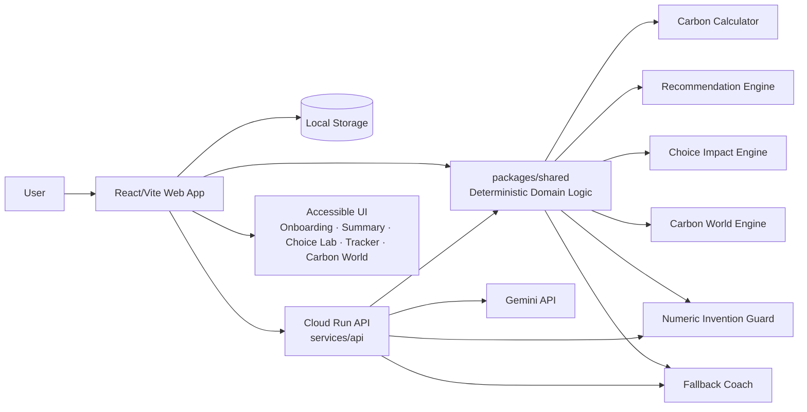
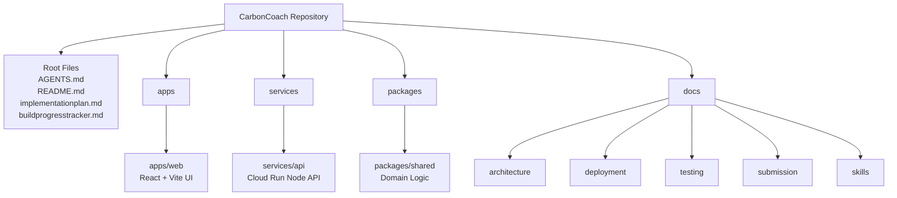
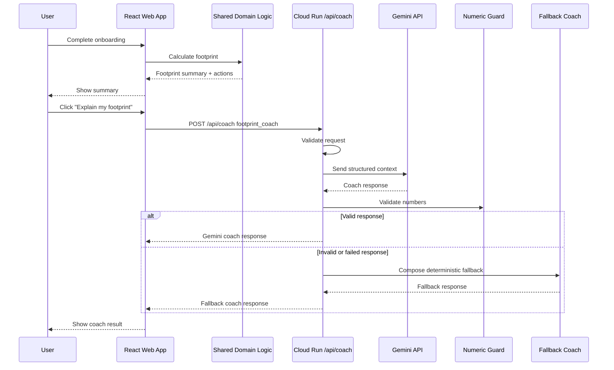
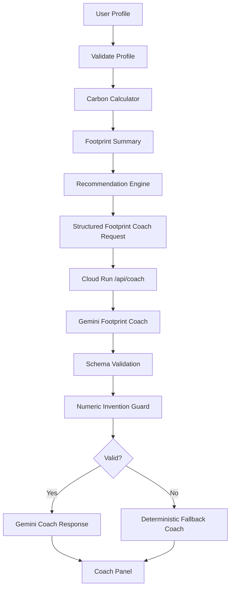
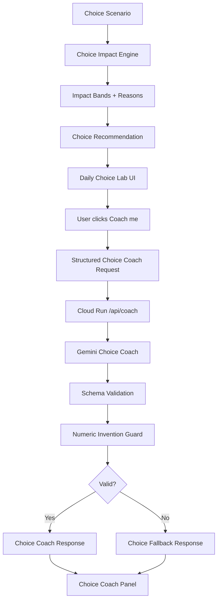
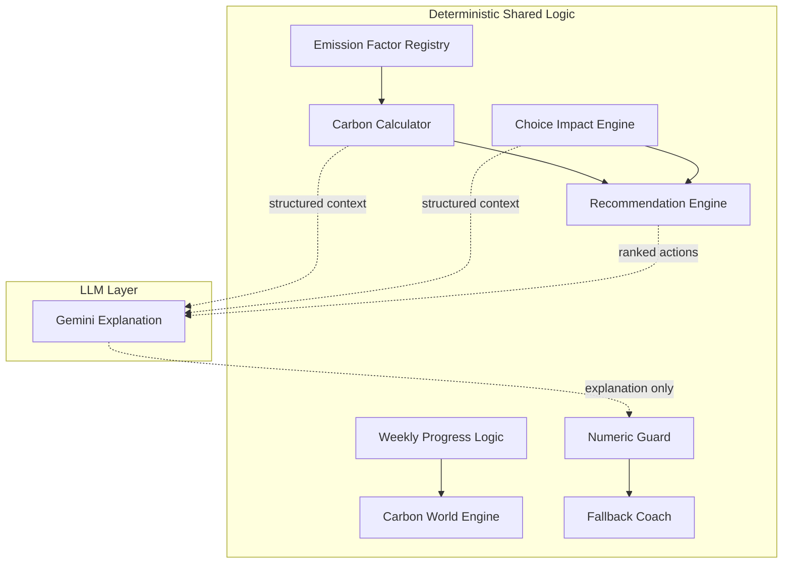
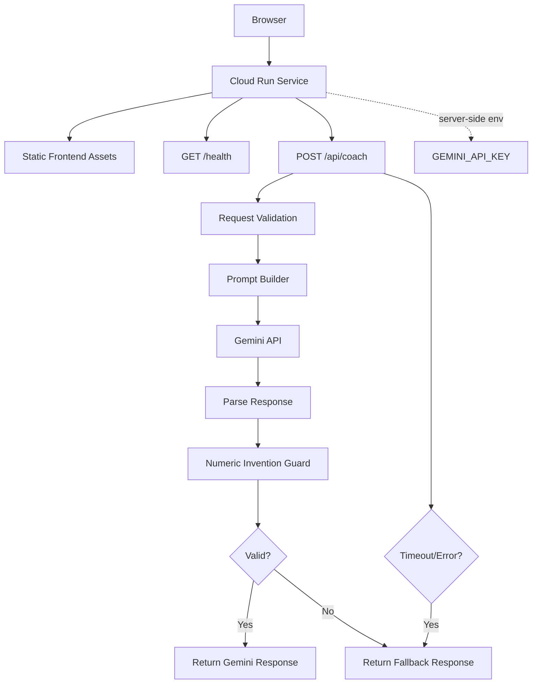
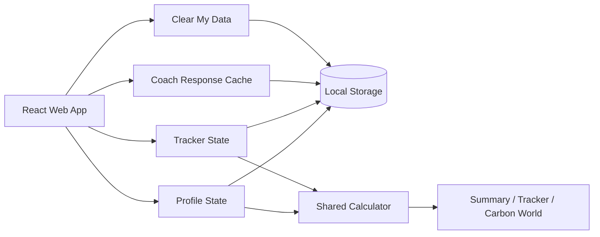
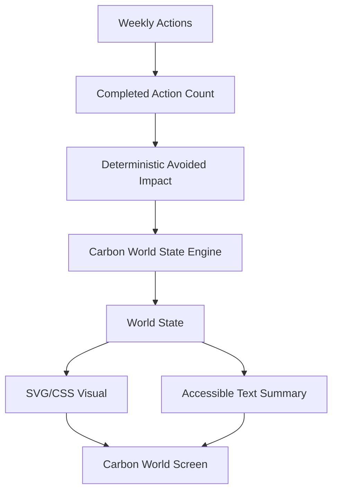

# CarbonCoach Architecture Diagrams

## Document Purpose

This document contains architecture diagrams for CarbonCoach.

The diagrams are written in Mermaid so they can render directly in GitHub Markdown.

---

# 1. High-Level System Architecture

---

# 2. Repository Architecture

---

# 3. Runtime Request Flow

---

# 4. Footprint Coach Flow

---

# 5. Choice Coach Flow

---

# 6. Deterministic Engine Boundaries

---

# 7. Cloud Run Deployment Architecture

---

# 8. Local-First Data Flow

---

# 9. Carbon World Flow

---

# 10. Scoring Alignment Diagram

```mermaid
flowchart TD
    CarbonCoach[CarbonCoach Architecture]

    CarbonCoach --> CQ[Code Quality]
    CarbonCoach --> SEC[Security]
    CarbonCoach --> EFF[Efficiency]
    CarbonCoach --> TEST[Testing]
    CarbonCoach --> A11Y[Accessibility]
    CarbonCoach --> ALIGN[Problem Alignment]

    CQ --> CQ1[Monorepo boundaries]
    CQ --> CQ2[Shared deterministic logic]
    CQ --> CQ3[Small UI components]

    SEC --> SEC1[Server-side Gemini key]
    SEC --> SEC2[Numeric guard]
    SEC --> SEC3[Local-first data]

    EFF --> EFF1[Cloud Run min instances 0]
    EFF --> EFF2[User-triggered LLM]
    EFF --> EFF3[No heavy graphics]

    TEST --> TEST1[Calculator tests]
    TEST --> TEST2[LLM fallback tests]
    TEST --> TEST3[A11Y smoke tests]

    A11Y --> A11Y1[Labels and keyboard]
    A11Y --> A11Y2[Non-color-only states]
    A11Y --> A11Y3[Carbon World text equivalent]

    ALIGN --> ALIGN1[Footprint Coach]
    ALIGN --> ALIGN2[Daily Choice Lab]
    ALIGN --> ALIGN3[Carbon World]
```

