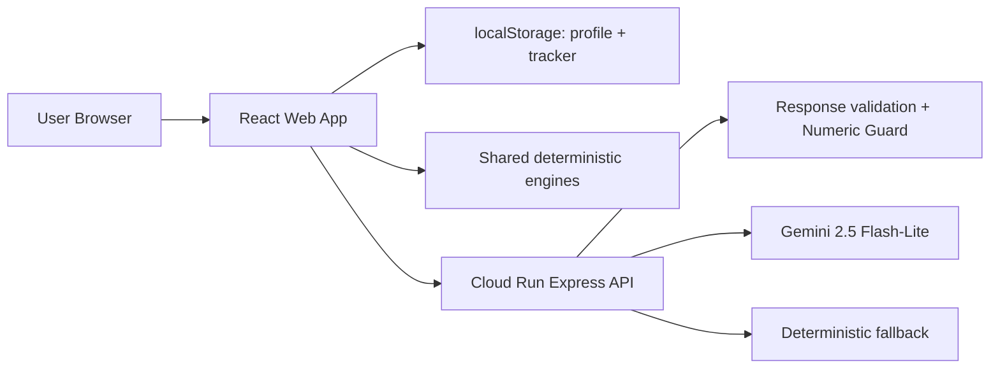

---

# Task 020 — README, Submission Docs, Demo Evidence, and LinkedIn Post

## Task Purpose

Prepare CarbonCoach for final PromptWars submission.

This task creates and/or finalizes the repository-facing submission documentation:

```text
README.md
docs/submission/final-score-evidence.md
docs/submission/prompt-strategy.md
docs/submission/architecture-summary.md
docs/submission/demo-walkthrough.md
docs/submission/final-submission-checklist.md
docs/submission/linkedin-post-draft.md
```

The goal is to make the repository immediately understandable to evaluators and reviewers:

```text
What problem CarbonCoach solves
How the deployed product works
Where Google Cloud Run and Gemini are used
How deterministic safety is enforced
How privacy is handled
How quality gates were verified
What claims the project intentionally does not make
```

This task is documentation and submission packaging only.

---

# 1. Required Reading Before Writing

Read first:

```text
AGENTS.md
implementationplan.md
buildprogresstracker.md

README.md
SECURITY.md
METHODOLOGY.md

docs/architecture/architecture-overview.md
docs/architecture/cloud-run-architecture.md
docs/architecture/llm-safety-design.md
docs/architecture/numeric-invention-guard.md
docs/deployment/cloud-run-free-tier.md

docs/skills/001-repo-foundation/SKILLS.md
docs/skills/018-accessibility-polish/SKILLS.md
docs/skills/019-cloud-run-deployment/SKILLS.md

walkthrough.md, if present
services/api/.env.example
package.json
```

Also inspect the final code structure:

```text
apps/web
services/api
packages/shared
docs
```

Do not rely on outdated assumptions. Use the current repository state.

---

# 2. Locked Submission Facts

Use these confirmed facts unless the repository now shows a newer value:

```text
Product name: CarbonCoach
Challenge theme: Carbon Footprint Awareness
Primary promise: Understand your footprint. Choose better every week.
Deployed URL: https://carboncoach-192872123770.asia-south1.run.app/
Google Cloud project: gen-lang-client-0021446342
Cloud Run service: carboncoach
Region: asia-south1
Runtime model: gemini-2.5-flash-lite
Deployment shape: single unified Express + React Cloud Run container
Storage model: browser localStorage only for profile and weekly tracker progress
Backend database: none
Authentication: none
Analytics: none
AI key handling: Gemini key server-side only
```

Do not publish secret values.

---

# 3. Product Positioning

Position CarbonCoach as:

```text
AI-assisted carbon awareness platform
Local-first lifestyle footprint estimator
Deterministic weekly action planner
Gemini-powered explanation coach
Motivational progress visualizer
```

Do not position it as:

```text
formal carbon accounting
verified emissions reporting
official inventory
offset marketplace
tree planting platform
financial savings calculator
enterprise ESG reporting tool
```

Use safe language:

```text
approximate estimate
directional impact bands
weekly action progress
lower-impact choices
awareness and behavior support
deterministic calculations
optional AI explanation
```

Avoid unsafe language:

```text
emissions saved
kg avoided
guaranteed savings
verified reduction
certified footprint
official accounting
carbon offset
trees planted
```

---

# 4. README.md Requirements

Rewrite or polish `README.md` as the main evaluator entry point.

Required sections:

```text
# CarbonCoach

Live Demo
Problem Statement
Solution Summary
Key Features
How It Uses Google Cloud and Gemini
Architecture
AI Safety Strategy
Privacy Model
Tech Stack
Repository Structure
Run Locally
Environment Variables
Quality Gates
Deployment
Challenge Alignment
Limitations / Non-Claims
License
```

## Live Demo

Include:

```text
Live Demo: https://carboncoach-192872123770.asia-south1.run.app/
```

Mention that the deployed demo uses Cloud Run and server-side Gemini configuration.

## Problem Statement

Explain that many users want to make climate-aware choices but find carbon data abstract, guilt-driven, or too complex.

## Solution Summary

Use concise wording such as:

```text
CarbonCoach turns lifestyle inputs into approximate footprint awareness, deterministic action plans, and optional Gemini-powered explanations. The app keeps personal profile and tracker progress local to the browser while Cloud Run handles user-triggered coach requests safely.
```

## Key Features

Include:

```text
Guided lifestyle profile
Deterministic footprint summary
Top contributor insight
Weekly action plan
Daily Choice Lab
Footprint Coach
Choice Coach
Weekly Tracker
Carbon World visual progress
Privacy & Local Data page
Estimates & Assumptions page
```

## Google Cloud and Gemini

Be explicit:

```text
Cloud Run serves the production web app and backend API.
Gemini 2.5 Flash-Lite powers user-triggered coach explanations.
The backend owns API-key access and response validation.
The frontend never receives the Gemini API key.
```

## AI Safety Strategy

Include the rule:

```text
Deterministic engines decide. LLMs explain.
```

Mention:

```text
minimized context
structured response validation
Numeric Invention Guard
deterministic fallback
server-side model access
```

## Privacy Model

State:

```text
No accounts.
No backend user database.
Profile and weekly tracker progress stay in browser localStorage.
Coach calls are optional and user-triggered.
Only minimized calculation context is sent to the backend for coach explanations.
```

## Quality Gates

Report the final commands:

```bash
npm run build
npm run typecheck
npm run test
npm run lint
npm run format:check
```

Use actual latest test counts if available from the final run. If the exact count is not visible, state that the full workspace test suite passes rather than inventing counts.

---

# 5. Submission Evidence Doc

Create:

```text
docs/submission/final-score-evidence.md
```

Purpose: map repository evidence to likely PromptWars evaluation categories.

Recommended structure:

```text
# Final Score Evidence

## Code Quality
## Security
## Efficiency
## Testing
## Accessibility
## AI / Gemini Integration
## Google Cloud Integration
## Product Alignment
## Demo Readiness
## Known Non-Goals
```

For each category, include:

```text
What was implemented
Where to inspect it
Why it matters
Verification evidence
```

Examples:

```text
Code Quality:
- Monorepo split into apps/web, services/api, packages/shared
- Shared deterministic engines outside UI components
- ESLint, TypeScript, Prettier, Vitest quality gates

Security:
- Server-side Gemini key only
- No VITE_GEMINI_API_KEY
- Local-first browser storage
- SECURITY.md
- Numeric Guard and fallback behavior

Google Cloud:
- Cloud Run deployed public demo
- /api/coach served by Cloud Run
- Gemini 2.5 Flash-Lite used in live user-triggered flows
```

Do not overclaim.

---

# 6. Prompt Strategy Doc

Create:

```text
docs/submission/prompt-strategy.md
```

Explain:

```text
How Antigravity was used task-by-task
How task skills controlled scope
How Gemini coach prompts were bounded
How Numeric Invention Guard prevented unsupported numbers
How copy safety was repeatedly checked
How UI polish was performed through ten focused fixes
```

Required sections:

```text
# Prompt Strategy

## Working Method
## Task Skills
## AI Safety Prompting
## Numeric Invention Guard
## Human Review Loop
## UI Polish Strategy
## What We Intentionally Did Not Ask AI To Do
```

Include the core distinction:

```text
Gemini is not asked to calculate emissions. It explains deterministic outputs already produced by shared TypeScript logic.
```

---

# 7. Architecture Summary Doc

Create:

```text
docs/submission/architecture-summary.md
```

Required sections:

```text
# Architecture Summary

## Runtime View
## Monorepo Structure
## Deterministic Domain Layer
## Web App Layer
## API Layer
## Gemini Coach Flow
## Privacy and Local Storage
## Deployment
## Safety Boundaries
```

Include a Mermaid diagram if the repository supports Markdown Mermaid:



Keep architecture truthful.

---

# 8. Demo Walkthrough Doc

Create:

```text
docs/submission/demo-walkthrough.md
```

Required demo steps:

```text
1. Open deployed URL
2. Set up profile
3. View Footprint Summary
4. Review Recommendations & Action Plan
5. Trigger Footprint Coach
6. Open Daily Choice Lab
7. Trigger Choice Coach
8. Start Weekly Tracker
9. Complete weekly actions
10. View Carbon World progression
11. Open Privacy & Local Data
12. Open Estimates & Assumptions
13. Clear local data
```

Include expected observations:

```text
No login required
Profile persists locally
Gemini coach response appears only after click
Carbon World changes with weekly action progress
Privacy and assumptions clarify limitations
```

Include clean browser instruction:

```text
Use Incognito or a clean browser profile for screenshots so browser extensions do not appear.
```

---

# 9. Final Submission Checklist

Create:

```text
docs/submission/final-submission-checklist.md
```

Checklist must include:

```text
Repository public
Main branch pushed
Live demo URL works
Cloud Run health endpoint works
Gemini Footprint Coach works
Gemini Choice Coach works
No exposed API key
All quality gates pass
README updated
Submission docs complete
LinkedIn post prepared
Screenshots captured in clean browser
No unsafe claims
No stale placeholder copy
```

Add space for final verification values:

```text
Final commit:
Deployed URL:
Submission time:
Reviewer:
```

---

# 10. LinkedIn Post Draft

Create:

```text
docs/submission/linkedin-post-draft.md
```

Tone:

```text
confident
technical
humble
not overclaiming climate impact
emphasize learning and engineering discipline
```

Required content:

```text
Product problem
What CarbonCoach does
Cloud Run + Gemini architecture
Deterministic-first AI safety
Local-first privacy
Prompt strategy / Antigravity workflow
Challenge submission link placeholder
Live demo link
```

Do not claim:

```text
solves climate change
accurately measures emissions
verified reductions
guaranteed impact
```

Suggested structure:

```text
I built CarbonCoach for the PromptWars carbon awareness challenge.

Most carbon tools either overwhelm users with numbers or guilt them into action. I wanted to build something calmer: approximate estimates, practical weekly choices, and AI explanations that never replace deterministic logic.

...
```

---

# 11. README Badges / Links

Optional but recommended:

```text
Live Demo badge/link
Cloud Run badge/link
Gemini 2.5 Flash-Lite mention
TypeScript / React / Express / Vitest badges if already used
```

Do not add badges that imply certification, audit, or production security.

---

# 12. Final Safety and Copy Checks

Run:

```bash
grep -R "emissions saved\|kg avoided\|avoided emissions\|reduced emissions\|verified impact\|verified reduction\|certified footprint\|guaranteed savings\|carbon offset\|trees planted\|fully secure\|zero risk\|enterprise-grade" README.md docs SECURITY.md METHODOLOGY.md apps/web/src

grep -R "VITE_GEMINI_API_KEY\|VITE_GOOGLE_API_KEY\|GoogleGenerativeAI\|GoogleGenAI" apps/web/src README.md docs

grep -R "coming soon\|placeholder\|TODO\|mock only\|debug" README.md docs apps/web/src
```

If terms appear only in negative “does not claim” sections, tests asserting absence, or harmless documentation context, report clearly.

---

# 13. Verification Commands

Run:

```bash
npm run build
npm run typecheck
npm run test
npm run lint
npm run format:check
```

Also verify deployed URL:

```text
https://carboncoach-192872123770.asia-south1.run.app/
```

Verify `/health` safely reports configured service status without exposing secrets.

---

# 14. Build Progress Tracker Update

Update `buildprogresstracker.md`:

```text
Task 020 — README, Submission Docs, Demo Evidence, and LinkedIn Post
Status: Review Ready
Owner/Agent: Antigravity
Outputs:
- README.md
- docs/submission/final-score-evidence.md
- docs/submission/prompt-strategy.md
- docs/submission/architecture-summary.md
- docs/submission/demo-walkthrough.md
- docs/submission/final-submission-checklist.md
- docs/submission/linkedin-post-draft.md
Verification:
- build
- typecheck
- test
- lint
- format
- copy safety grep
- deployed URL smoke
```

Do not mark complete until human review accepts the submission package.

---

# 15. Acceptance Criteria

Task 020 is successful when:

```text
README clearly explains product, architecture, deployment, AI safety, privacy, and local setup.
Submission docs exist and are truthful.
Live demo URL is prominent.
Cloud Run and Gemini are clearly documented as real product flows.
Numeric Guard and deterministic-first approach are documented.
No unsupported climate, savings, security, or AI claims are introduced.
Quality gates pass.
Deployed app smoke is documented.
LinkedIn post draft is ready.
buildprogresstracker.md is updated.
```

---

# 16. Expected Agent Report Format

Report:

```text
Files changed

README updates

Submission docs created

Live demo evidence added

Prompt strategy summary

Architecture summary

LinkedIn draft summary

Safety/copy checks

Quality gate results

Deployed URL smoke result

Any remaining submission blockers
```

---

# 17. Commit Recommendation

After review:

```bash
git add .
git commit -m "docs: finalize CarbonCoach challenge submission package"
git push origin main
```

---

# Final Instruction

Implement Task 020 only.

Do not change production product code unless a documentation smoke check reveals a serious, directly related broken link or stale visible claim.

Do not add new features, new infrastructure, new coach behavior, or new deployment changes.

The goal is to prepare a truthful, polished, evaluator-ready submission package for CarbonCoach.
