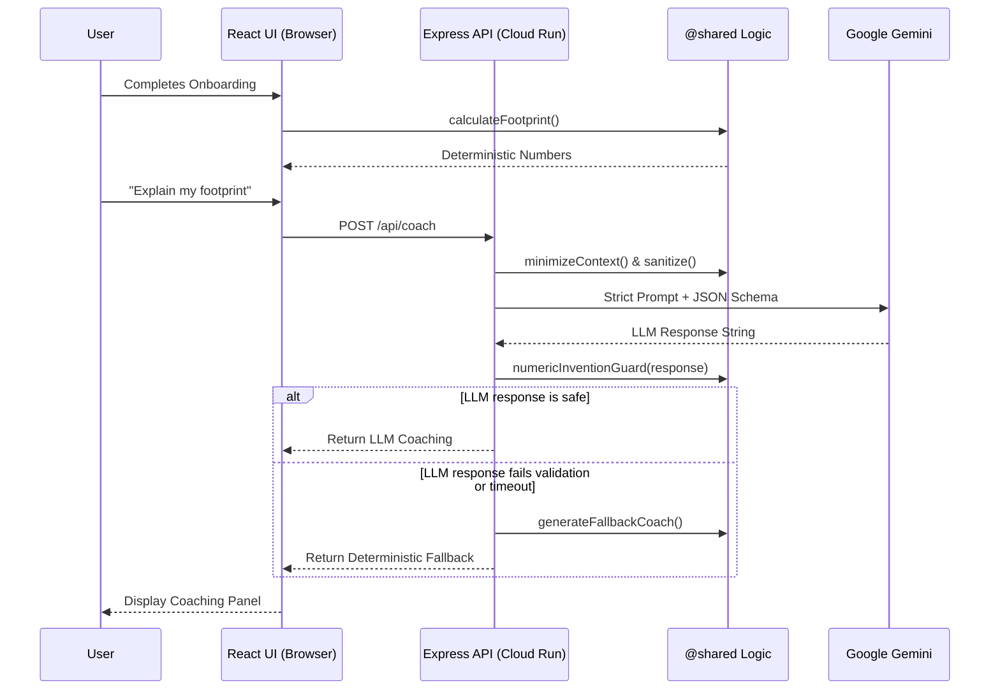

# Architecture Summary

CarbonCoach utilizes a unified container architecture optimized for Google Cloud Run. This ensures minimal infrastructure overhead while providing a highly secure boundary around generative AI execution.

## High-Level Request Flow

## Security & Deployment Boundaries

- **Single Process / Single Container:** The Cloud Run container serves the static compiled React app natively through Express, removing the need for separate hosting platforms.
- **Server-Side LLM Orchestration:** The browser never possesses the `GEMINI_API_KEY`. The backend constructs prompts securely using bounded contexts.
- **Payload & CORS Enforcement:** The API rejects unverified origins and strictly caps payload sizes at 10kb to prevent abuse or context-flooding.
- **Fail-Fast Environment Validation:** If the application boots without necessary configurations, it crashes gracefully before accepting traffic, simplifying debugging.
